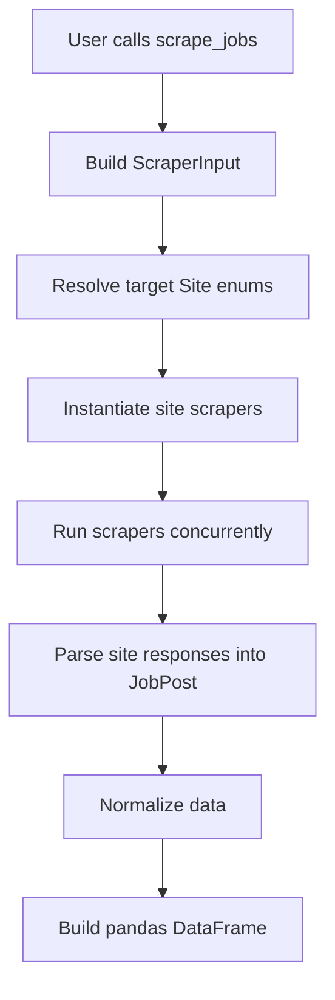

# JobSpy Documentation

## Overview

`JobSpy` is a concurrent Python job scraping library that aggregates multiple job boards behind a single API.

Main goals:

- scrape jobs from multiple sites with one function,
- normalize outputs into one schema,
- return a single `pandas.DataFrame`.

The public entry point is `scrape_jobs()` from `jobspy/__init__.py`.

---

## Contents

- Overview
- Installation
- Quick usage
- Public API
- Architecture
- Project structure
- Engine used in this codebase
- How scraping works
- Data model
- How to add a feature
- How to add a new scraper
- Example: adding JobStreet
- Notes and limitations
- FAQ

---

## Installation

```bash
pip install -U python-jobspy
```

Requirements:

- Python 3.10+

Main dependencies from `pyproject.toml`:

- `requests`
- `beautifulsoup4`
- `pandas`
- `numpy`
- `pydantic`
- `tls-client`
- `markdownify`
- `regex`

---

## Quick Usage

```python
import csv
from jobspy import scrape_jobs

jobs = scrape_jobs(
    site_name=["indeed", "linkedin", "zip_recruiter", "google", "jobstreet"],
    search_term="software engineer",
    google_search_term="software engineer jobs near San Francisco, CA since yesterday",
    location="San Francisco, CA",
    results_wanted=20,
    hours_old=72,
    country_indeed="USA",
)

print(f"Found {len(jobs)} jobs")
print(jobs.head())

jobs.to_csv(
    "jobs.csv",
    quoting=csv.QUOTE_NONNUMERIC,
    escapechar="\\",
    index=False,
+)
```

---

## Public API

Main function:

```python
scrape_jobs(
    site_name=None,
    search_term=None,
    google_search_term=None,
    location=None,
    distance=50,
    is_remote=False,
    job_type=None,
    easy_apply=None,
    results_wanted=15,
    country_indeed="usa",
    proxies=None,
    ca_cert=None,
    description_format="markdown",
    linkedin_fetch_description=False,
    linkedin_company_ids=None,
    offset=0,
    hours_old=None,
    enforce_annual_salary=False,
    verbose=0,
    user_agent=None,
    **kwargs,
)
```

Returns:

- `pandas.DataFrame`

Important parameters:

- `site_name`: `linkedin`, `indeed`, `zip_recruiter`, `glassdoor`, `google`, `bayt`, `naukri`, `bdjobs`, `jobstreet`
- `search_term`: main search query
- `google_search_term`: Google Jobs query
- `location`: location filter
- `results_wanted`: number of jobs per site
- `country_indeed`: country mapping for Indeed and Glassdoor
- `proxies`: proxy list or single proxy
- `description_format`: `markdown` or `html`
- `linkedin_fetch_description`: fetches extra LinkedIn details
- `enforce_annual_salary`: converts non-annual salary to yearly
- `verbose`: logging level

Search limitations:

### Indeed

Only one of the following can be used together:

- `hours_old`
- `job_type` and `is_remote`
- `easy_apply`

### LinkedIn

Only one of the following can be used together:

- `hours_old`
- `easy_apply`

---

## Architecture

The codebase is modular.

- `jobspy/__init__.py` orchestrates all scrapers.
- `jobspy/model.py` defines the shared schema and abstract contracts.
- `jobspy/util.py` provides the shared HTTP/session/proxy/parser helpers.
- `jobspy/<site>/` contains each site scraper implementation.

High-level flow:



---

## Project Structure

```plaintext
JobSpy/
├── LICENSE
├── README.md
├── DOCS.md
├── pyproject.toml
└── jobspy/
    ├── __init__.py
    ├── exception.py
    ├── model.py
    ├── util.py
    ├── bayt/
    ├── bdjobs/
    ├── glassdoor/
    ├── google/
    ├── indeed/
    ├── linkedin/
    ├── naukri/
    └── ziprecruiter/
```

### Key files

#### `jobspy/__init__.py`

Responsibilities:

- exposes `scrape_jobs()`
- maps `Site` values to concrete scraper classes
- runs each scraper with `ThreadPoolExecutor`
- aggregates `JobResponse`
- flattens data to a DataFrame

#### `jobspy/model.py`

Defines:

- `JobType`
- `Country`
- `Location`
- `CompensationInterval`
- `Compensation`
- `DescriptionFormat`
- `JobPost`
- `JobResponse`
- `Site`
- `SalarySource`
- `ScraperInput`
- `Scraper` abstract base class

#### `jobspy/util.py`

Defines the shared scraping support layer:

- `create_logger`
- `RotatingProxySession`
- `RequestsRotating`
- `TLSRotating`
- `create_session`
- `set_logger_level`
- `markdown_converter`
- `plain_converter`
- `extract_emails_from_text`
- `extract_salary`
- `extract_job_type`
- `map_str_to_site`
- `convert_to_annual`
- `desired_order`

#### `jobspy/exception.py`

Contains scraper-specific exception classes.

#### `jobspy/<site>/__init__.py`

Contains the actual scraper implementation for each site.

#### `jobspy/<site>/constant.py`

Contains headers, URLs, query templates, or request constants.

#### `jobspy/<site>/util.py`

Contains parsing helpers unique to that target website.

---

## Engine Used in This Codebase

This project does not use a browser automation engine.

It uses a request-based scraping engine composed of these layers.

### 1. Concurrency engine

Used in `jobspy/__init__.py`:

- `ThreadPoolExecutor`
- `as_completed`

Purpose:

- scrape multiple job sites in parallel
- reduce total execution time

### 2. HTTP engine

Used in `jobspy/util.py`.

#### `RequestsRotating`

Built on `requests.Session`.

Features:

- optional retries through `HTTPAdapter` and `Retry`
- per-request proxy rotation
- optional cookie clearing

#### `TLSRotating`

Built on `tls_client.Session`.

Features:

- browser-like TLS behavior
- proxy rotation
- useful for sites that are more sensitive to TLS fingerprinting

### 3. Session factory

`create_session()` is the central session constructor.

It decides whether to create:

- a standard retryable requests session, or
- a TLS-enabled session.

It also applies:

- proxies
- CA cert
- retry behavior
- cookie clearing behavior

### 4. Parsing engine

The parsing layer uses:

- `BeautifulSoup` for HTML parsing
- `regex` / `re` for text extraction
- JSON parsing for internal APIs and endpoints

### 5. Normalization engine

Uses:

- Pydantic models from `jobspy/model.py`
- pandas DataFrame aggregation in `jobspy/__init__.py`

### 6. Data conversion helpers

Used in `jobspy/util.py`:

- `markdown_converter()` converts HTML description to markdown
- `plain_converter()` converts HTML to plain text
- `extract_salary()` extracts salary text heuristically
- `convert_to_annual()` normalizes salary intervals

In short, the engine stack is:

- concurrency: `ThreadPoolExecutor`
- transport: `requests` and `tls-client`
- proxy rotation: custom rotating session classes
- parsing: `BeautifulSoup`, JSON, regex
- normalization: Pydantic and pandas

---

## How Scraping Works

### Step 1: Build input contract

The public function `scrape_jobs()` converts user arguments into a shared `ScraperInput` model.

This includes:

- target sites
- search term
- google search term
- location
- country
- filters
- pagination info
- output formatting options

### Step 2: Map requested sites

Strings such as `"indeed"` are mapped into `Site` enum values.

### Step 3: Instantiate scraper classes

Each selected site is resolved through `SCRAPER_MAPPING` in `jobspy/__init__.py`.

Example:

- `Site.INDEED -> Indeed`
- `Site.LINKEDIN -> LinkedIn`
- `Site.GOOGLE -> Google`

### Step 4: Run concurrently

Each site scraper is executed in a thread.

This allows multiple sites to scrape in parallel.

### Step 5: Site-specific fetching

Each scraper then uses its own strategy.

Examples from the codebase:

- **Indeed**: GraphQL/API-based search
- **Glassdoor**: API-like requests with paging cursors
- **Google**: initial search page + async callback pagination
- **LinkedIn**: HTML parsing and optional detail fetching
- **Naukri**: API-based JSON responses
- **Bayt / BDJobs**: HTML parsing flow
- **ZipRecruiter**: API-backed flow

### Step 6: Normalize into `JobPost`

Each scraper converts raw site data into `JobPost` models.

Normalized fields include:

- `title`
- `company_name`
- `job_url`
- `location`
- `description`
- `compensation`
- `date_posted`
- `job_type`
- `emails`
- `is_remote`

### Step 7: Post-processing

Shared helper functions can then:

- extract emails from text
- parse salary ranges from descriptions
- convert HTML descriptions into markdown/plain text
- normalize salary intervals to annual values

### Step 8: Aggregate all site results

The main orchestrator then:

- flattens every `JobPost`
- extracts compensation fields
- formats location into a display string
- ensures expected columns exist
- applies `desired_order`
- sorts by `site` and `date_posted`

Final output is one DataFrame.

---

## Data Model

Shared schema is defined in `jobspy/model.py`.

```plaintext
JobPost
├── id
├── title
├── company_name
├── job_url
├── job_url_direct
├── location
│   ├── country
│   ├── city
│   └── state
├── description
├── company_url
├── company_url_direct
├── job_type
├── compensation
│   ├── interval
│   ├── min_amount
│   ├── max_amount
│   └── currency
├── date_posted
├── emails
├── is_remote
├── listing_type
├── job_level
├── company_industry
├── company_addresses
├── company_num_employees
├── company_revenue
├── company_description
├── company_logo
├── banner_photo_url
├── job_function
├── skills
├── experience_range
├── company_rating
├── company_reviews_count
├── vacancy_count
└── work_from_home_type
```

This unified model is what makes aggregation possible across very different job boards.

---

## How to Add a Feature

### Add a shared feature

Examples:

- a new normalized field
- a new output column
- a new salary rule
- a new global filter

Typical files to touch:

- `jobspy/model.py`
- `jobspy/util.py`
- `jobspy/__init__.py`
- site modules if needed

Recommended flow:

1. add or update the field in the schema,
2. populate it in the relevant scraper(s),
3. flatten it in `jobspy/__init__.py`,
4. add it to `desired_order` if needed,
5. document it.

### Add a site-specific feature

Examples:

- LinkedIn-only parsing improvement
- Indeed-only metadata extraction
- Naukri-specific field enhancement

Typical files:

- `jobspy/<site>/__init__.py`
- `jobspy/<site>/util.py`
- optionally `jobspy/model.py`

### Add a new public parameter

If the feature is a new `scrape_jobs()` option:

1. add it to `scrape_jobs()`
2. add it to `ScraperInput`
3. use it in the relevant scraper(s)
4. update documentation

---

## How to Add a New Scraper

Repeatable pattern:

1. create `jobspy/<newsite>/`
2. implement a class extending `Scraper`
3. add constants/helpers
4. add a `Site` enum value
5. register it in `SCRAPER_MAPPING`
6. optionally add a custom exception
7. return normalized `JobPost` objects

Minimal expected structure:

```plaintext
jobspy/jobstreet/
├── __init__.py
├── constant.py
└── util.py
```

Implementation checklist:

### A. Add enum entry

In `jobspy/model.py`:

```python
JOBSTREET = "jobstreet"
```

### B. Add scraper class

The new class must inherit from `Scraper` and implement:

```python
def scrape(self, scraper_input: ScraperInput) -> JobResponse:
    ...
```

### C. Register mapping

In `jobspy/__init__.py`:

```python
Site.JOBSTREET: JobStreet,
```

### D. Keep output normalized

Every record should be converted into `JobPost`.

---

## Example: Adding JobStreet

This is a scaffold example for a future `JobStreet` scraper.

### `jobspy/jobstreet/constant.py`

```python
headers = {
    "accept": "text/html,application/xhtml+xml,application/xml;q=0.9,*/*;q=0.8",
    "accept-language": "en-US,en;q=0.9",
    "user-agent": "Mozilla/5.0 (Macintosh; Intel Mac OS X 10_15_7) AppleWebKit/537.36 (KHTML, like Gecko) Chrome/130.0.0.0 Safari/537.36",
}

base_url = "https://www.jobstreet.com"
search_path = "/jobs"
```

### `jobspy/jobstreet/util.py`

```python
from datetime import datetime, timedelta


def parse_relative_date(text: str):
    if not text:
        return None

    lower = text.lower().strip()
    today = datetime.today().date()

    if "today" in lower or "just posted" in lower:
        return today
    if "yesterday" in lower:
        return today - timedelta(days=1)
    if "day" in lower:
        try:
            days = int(lower.split()[0])
            return today - timedelta(days=days)
        except Exception:
            return None
    return None
```

### `jobspy/jobstreet/__init__.py`

```python
from __future__ import annotations

from bs4 import BeautifulSoup

from jobspy.jobstreet.constant import headers, base_url, search_path
from jobspy.jobstreet.util import parse_relative_date
from jobspy.model import (
    JobPost,
    JobResponse,
    Location,
    Scraper,
    ScraperInput,
    Site,
)
from jobspy.util import create_logger, create_session, markdown_converter

log = create_logger("JobStreet")


class JobStreet(Scraper):
    jobs_per_page = 20

    def __init__(
        self,
        proxies: list[str] | str | None = None,
        ca_cert: str | None = None,
        user_agent: str | None = None,
    ):
        super().__init__(Site.JOBSTREET, proxies=proxies, ca_cert=ca_cert, user_agent=user_agent)
        self.session = create_session(
            proxies=self.proxies,
            ca_cert=ca_cert,
            is_tls=False,
            has_retry=True,
            delay=3,
            clear_cookies=True,
        )
        self.session.headers.update(headers)

    def scrape(self, scraper_input: ScraperInput) -> JobResponse:
        jobs = []
        page = 1

        while len(jobs) < scraper_input.results_wanted + scraper_input.offset:
            page_jobs = self._scrape_page(scraper_input, page)
            if not page_jobs:
                break
            jobs.extend(page_jobs)
            page += 1

        return JobResponse(
            jobs=jobs[scraper_input.offset : scraper_input.offset + scraper_input.results_wanted]
        )

    def _scrape_page(self, scraper_input: ScraperInput, page: int) -> list[JobPost]:
        params = {
            "q": scraper_input.search_term,
            "page": page,
        }
        if scraper_input.location:
            params["l"] = scraper_input.location

        response = self.session.get(f"{base_url}{search_path}", params=params)
        response.raise_for_status()

        soup = BeautifulSoup(response.text, "html.parser")
        cards = soup.select("article")

        results = []
        for card in cards:
            title_el = card.select_one("a")
            company_el = card.select_one("[data-automation='jobCompany']")
            location_el = card.select_one("[data-automation='jobLocation']")
            description_el = card.select_one("[data-automation='jobShortDescription']")
            date_el = card.select_one("time")

            if not title_el:
                continue

            href = title_el.get("href")
            job_url = href if href and href.startswith("http") else f"{base_url}{href}"

            results.append(
                JobPost(
                    title=title_el.get_text(strip=True),
                    company_name=company_el.get_text(strip=True) if company_el else None,
                    job_url=job_url,
                    location=Location(
                        country="Singapore",
                        city=location_el.get_text(strip=True) if location_el else None,
                    ),
                    description=markdown_converter(str(description_el)) if description_el else None,
                    date_posted=parse_relative_date(date_el.get_text(strip=True)) if date_el else None,
                )
            )

        return results
```

### Additional integration steps

In `jobspy/model.py`:

```python
class Site(Enum):
    JOBSTREET = "jobstreet"
```

In `jobspy/exception.py`:

```python
class JobStreetException(Exception):
    def __init__(self, message=None):
        super().__init__(message or "An error occurred with JobStreet")
```

In `jobspy/__init__.py`:

```python
from jobspy.jobstreet import JobStreet
```

and register it in `SCRAPER_MAPPING`.

---

## Notes and Limitations

- Indeed is generally one of the strongest scrapers in this repository.
- Most job boards cap accessible results at around 1000 jobs per search.
- LinkedIn is one of the most restrictive targets.
- Proxies are recommended for repeated scraping.
- HTML scrapers are more sensitive to frontend markup changes.
- API-based scrapers are more stable until endpoint contracts change.

---

## FAQ

### Why does Indeed return unrelated jobs?

Because Indeed search can match descriptions, not only titles.

Example query:

```python
search_term='"engineering intern" software summer (java OR python OR c++) 2025 -tax -marketing'
```

### Why does Google sometimes return no jobs?

Because `google_search_term` must be highly specific and usually copied from the Google Jobs UI.

### What does 429 mean?

It means the target site is rate-limiting or blocking the client.

Mitigations:

- reduce request frequency
- use proxies
- avoid aggressive paging

### Is this using Selenium or Playwright?

No. This codebase is request-based.

It uses:

- `requests`
- `tls-client`
- `BeautifulSoup`
- JSON parsing

### Why can all sites be aggregated together?

Because every site scraper converts raw output into the same `JobPost` schema before aggregation.
